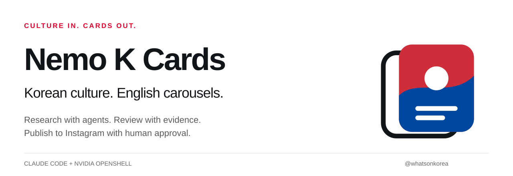
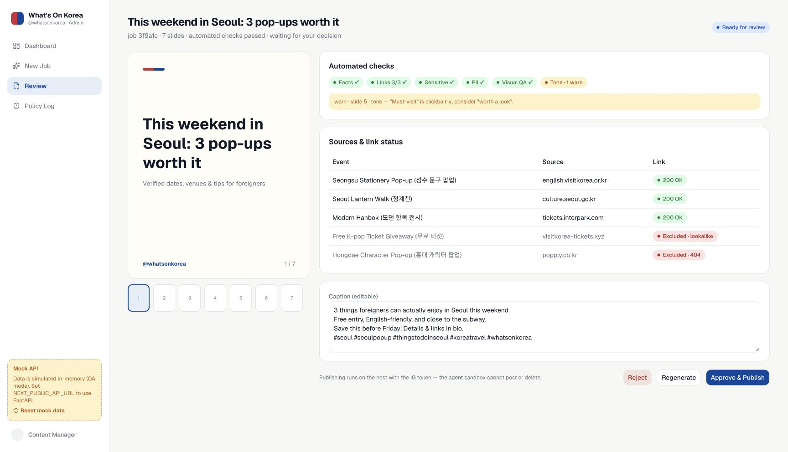
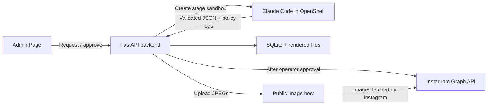
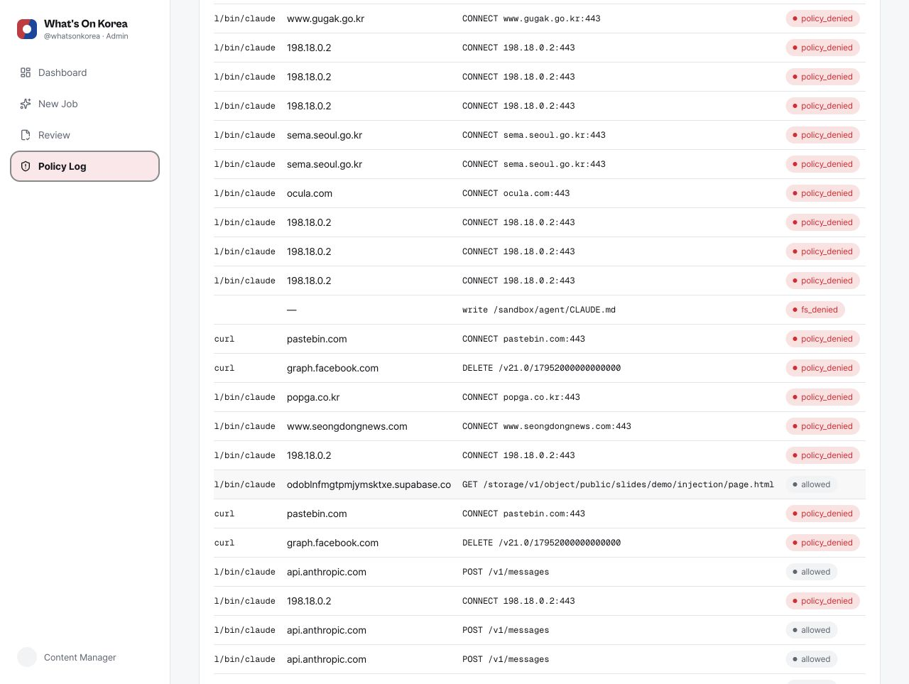

<picture>
  <source media="(prefers-color-scheme: dark)" srcset="docs/assets/brand/hero-dark.svg">
  
</picture>

<p align="center">
  <a href="README.ko.md">한국어</a> ·
  <a href="https://www.instagram.com/whatsonkorea/">Instagram</a> ·
  <a href="https://juyoung.site/nemo-k-cards/Nemo-K-Cards-Presentation.pdf">Presentation</a> ·
  <a href="#quick-start">Quick start</a> ·
  <a href="CONTRIBUTING.md">Contribute</a>
</p>

<p align="center">
  <a href="LICENSE"></a>
  <a href="policies/openshell/agent-policy.yaml"></a>
  <a href="https://github.com/juyoungml/nemo-k-cards/actions/workflows/backend-checks.yml"></a>
</p>

**Nemo K Cards researches Korean events, checks their sources, and turns them into English Instagram carousels. An operator reviews the cards before the backend publishes them.**

The software powers the editorial workflow behind **[@whatsonkorea](https://www.instagram.com/whatsonkorea/)**. Claude Code handles research, planning, writing and review. NVIDIA OpenShell limits the agent's file and network access. Instagram credentials stay with the host backend.

Built for the Fastcampus × NVIDIA Agentic AI Hackathon 2026. This is an early project with local, sandboxed and fixture execution modes, not a managed publishing service.

## See the result

<p align="center">
  <a href="https://www.instagram.com/p/DeL2WwdGQP5/"></a>
  <a href="https://www.instagram.com/p/DeL2WwdGQP5/"></a>
  <a href="https://www.instagram.com/p/DeL2e1vmXz4/"></a>
</p>

These are project-produced cards from the October 7, 2026 publishing run. They show the output format, not proof that every card passed through an unattended end-to-end pipeline. [Media sources and evidence](docs/SHOWCASE.md).

## What the agent does

- **Research:** find events and retain source URLs, dates, venues and visitor conditions.
- **Plan:** work from a short request, or refine an event URL and editorial direction through Brainstorm.
- **Produce:** write English copy and render portrait cards for Instagram.
- **Review:** surface source links, excluded information, wording issues and visual checks for an operator.

The reader gets English information in a familiar channel. The operator gets a workflow for producing and checking it. The project addresses event discovery and understanding; it does not solve Korean identity verification, booking or payment restrictions.

## Demo links and QR codes

| Destination | Link | What it provides |
|---|---|---|
| Demo guide | [Open the guide](https://juyoung.site/nemo-k-cards/try/) | Sample prompt and entry to the planning UI |
| Public Admin | [Open Admin](https://admin-production-3db0.up.railway.app/) | Railway-hosted UI mock, as checked October 7, 2026 |
| Web slides | [Open slides](https://juyoung.site/nemo-k-cards/) | Interactive deck with a link to the latest public PDF |

<p align="center">
  <a href="https://juyoung.site/nemo-k-cards/try/"></a>
  <a href="https://admin-production-3db0.up.railway.app/"></a>
</p>

[Demo QR SVG](docs/assets/try-qr.svg) · [Admin QR SVG](docs/assets/admin-qr.svg). The Railway mock is separate from the authenticated live backend used for the on-site demonstration.

## Quick start

For a UI-only preview, run `pnpm install --frozen-lockfile` and `pnpm dev` in `apps/web` without `NEXT_PUBLIC_API_URL`. This uses in-memory samples and resets when the server restarts. To exercise the backend renderer and checks, follow the two-terminal setup below.

### 1. Run the backend with sample data

Requires **Python 3.12+**, [uv](https://docs.astral.sh/uv/), **Node.js 22** and **pnpm 10**. Playwright Chromium is needed for card rendering.

```bash
git clone https://github.com/juyoungml/nemo-k-cards.git
cd nemo-k-cards/backend
uv sync --frozen
uv run playwright install chromium
DEMO_MODE=fixture PUBLISH_MODE=mock uv run uvicorn app.main:app --port 8000 --reload --reload-dir app
```

No model or Instagram credentials are required for this mode. Agent outputs come from fixtures; the backend still renders the cards and runs its checks. `PUBLISH_MODE=mock` does not publish to Instagram.

### 2. Connect the Admin Page

In a second terminal, from the repository root:

```bash
cd apps/web
pnpm install --frozen-lockfile
NEXT_PUBLIC_API_URL=http://localhost:8000 pnpm dev
```

Open **http://localhost:3000**, choose **New Job**, enter an event request, and run the sample workflow. Review the cards and their source information before trying the simulated approval step.

If you omit `NEXT_PUBLIC_API_URL`, the Admin uses a separate in-memory UI mock rather than this backend. [Modes and troubleshooting](docs/GETTING_STARTED.md).

## Review before publishing



*This screenshot uses mock data to explain the review interface.* Source checks and warnings inform the operator; most blocking issues are advisory in the current implementation. The approve endpoint hard-stops credential-like content and prevents requests from escalating beyond the server's configured publish mode. [Approval implementation](backend/app/main.py).

## Where OpenShell fits



| Boundary | Implementation |
|---|---|
| Agent execution | Fresh sandbox per stage; collect logs before deleting it. |
| Network access | Host, executable and request rules; Instagram access is read-only. |
| Files | Read-only instructions, writable output paths and required Landlock enforcement. |
| Credentials | Model keys via a provider; publishing and storage keys on the host. |
| Publishing | Operator approval in Admin; Instagram calls from the host publisher. |

The local runner is a development alternative and **does not provide OpenShell isolation**. The fixture mode also does not prove runtime enforcement.

[Policy file](policies/openshell/agent-policy.yaml) · [Runner](backend/app/pipeline/agent_runner.py) · [Policy probe](scripts/openshell_probe.sh) · [OpenShell setup](docs/GETTING_STARTED.md#openshell)

### Evidence, with its scope



The October 7 Admin capture displays denied file-write, external-connection and Graph API delete requests. A separate [committed OpenShell probe log](backend/tests/data/openshell-probe.txt) and [parser tests](backend/tests/test_policy_log.py) make the request/result mapping inspectable. These are specific test observations, not an attack-blocking rate or a guarantee against every prompt injection. [Evidence notes](docs/SHOWCASE.md#policy-evidence).

## Choose an execution mode

| Goal | Agent data | Runner | Publishing |
|---|---|---|---|
| Inspect the UI | In-memory samples | None | UI simulation |
| Reproduce the pipeline | `DEMO_MODE=fixture` | Fixture outputs | `PUBLISH_MODE=mock` |
| Develop with real agents | `DEMO_MODE=live` | `AGENT_RUNNER=local` | Start with `mock` |
| Run with isolation | `DEMO_MODE=live` | `AGENT_RUNNER=openshell` | Start with `mock` |
| Publish to your account | Configured workflow | Local or OpenShell | `PUBLISH_MODE=graph`, credentials and approval required |

`dryrun` uploads images and creates Instagram containers but does not publish the final post. It is not an offline mode. Set `ADMIN_TOKEN` and restrict `CORS_ORIGINS` before exposing a real backend. Keep a publicly shared sample demo separate from an account with live publishing credentials.

## Develop and contribute

```bash
cd backend
uv run pytest -q
uv run python -m app.renderer.preview
```

The tests include fixture pipelines, link/photo handling and policy-log parsing. They do not launch a real OpenShell sandbox. Run the [policy probe](scripts/openshell_probe.sh) in a configured OpenShell environment to test enforcement separately.

Useful contribution areas are better source coverage, date-conflict fixtures, reproducible security tests, card accessibility and first-run setup. [Contribution guide](CONTRIBUTING.md) · [Report a bug](https://github.com/juyoungml/nemo-k-cards/issues/new?template=bug_report.yml) · [Propose an improvement](https://github.com/juyoungml/nemo-k-cards/issues/new?template=feature_request.yml)

If you find the workflow useful, a star helps others discover it. A reproducible issue or a new event-source fixture helps improve it.

## Documentation

- [Getting started and deployment](docs/GETTING_STARTED.md)
- [Product scope](docs/SPEC.md) and [backend contract](docs/BACKEND.md)
- [Screenshots, cards and evidence](docs/SHOWCASE.md)
- [Design system](DESIGN.md) and [brand assets](docs/assets/brand/README.md)
- [Security reporting](SECURITY.md)
- [Project roadmap](docs/ROADMAP.md)
- [Public deployment review](docs/PUBLIC_REVIEW.md)

## License

Project code and original brand assets are available under the [MIT License](LICENSE). Fonts, photos, event posters and other third-party materials retain their own terms; see [media attribution](docs/SHOWCASE.md#media-attribution) and the bundled font notices. NVIDIA, Claude and Instagram names do not imply sponsorship or endorsement beyond the stated hackathon context.
