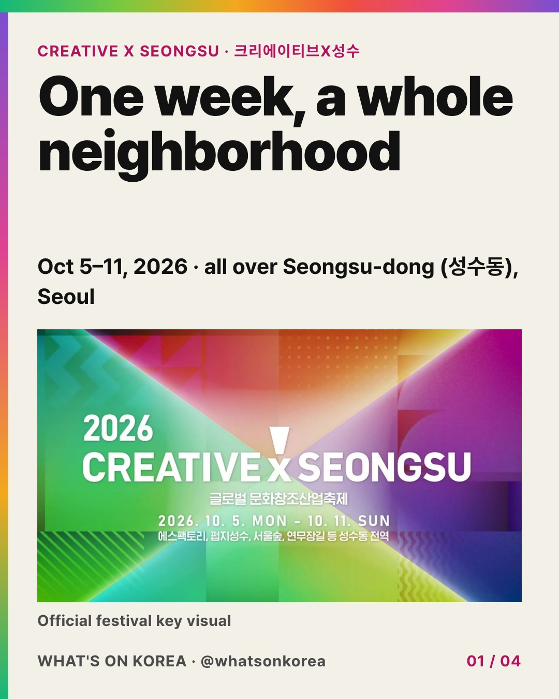
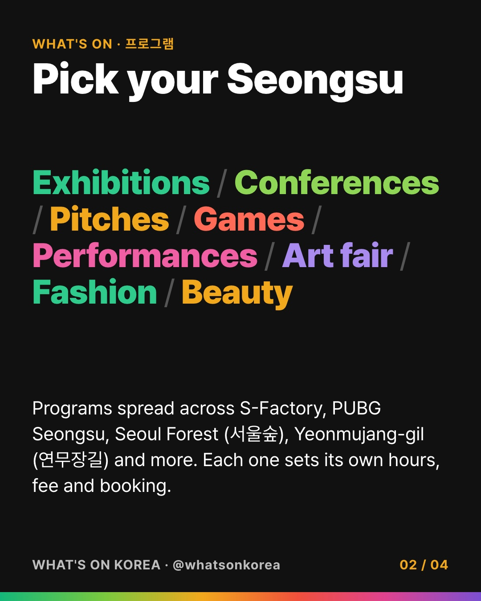
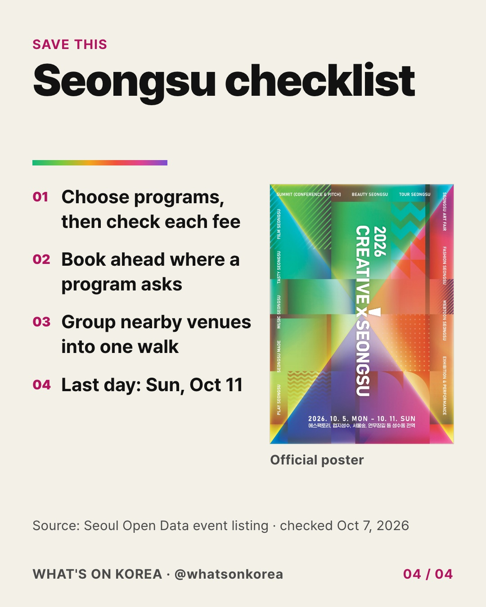

<div align="center">

# What's On Korea

**한국 행사 소식을 외국인을 위한 영어 카드뉴스로.**

Claude Code × NVIDIA OpenShell × Human Review

Fastcampus × NVIDIA Agentic AI Hackathon

[**기획 데모 체험**](https://juyoung.site/nemo-k-cards/try/) | [**Admin 열기**](https://admin-production-3db0.up.railway.app/) | [**발표 보기**](https://juyoung.site/nemo-k-cards/) | [**Instagram**](https://www.instagram.com/whatsonkorea/)

</div>

---

행사 조사부터 출처 검증, 영어 문안 작성, 카드 렌더링과 검수까지 에이전트가 처리합니다. 운영자는 카드와 검수 결과를 확인한 뒤 게시를 승인합니다. `AGENT_RUNNER=openshell`에서는 Claude Code가 NVIDIA OpenShell의 파일 및 네트워크 정책 안에서 실행되고, Instagram 게시 자격 증명은 호스트 백엔드에만 둡니다.

## 접속 URL과 QR 코드

| 접속 대상 | URL | 용도 |
| --- | --- | --- |
| 체험 안내 | [juyoung.site/nemo-k-cards/try/](https://juyoung.site/nemo-k-cards/try/) | 예시 요청과 기획 데모 진입 |
| Admin | [admin-production-3db0.up.railway.app](https://admin-production-3db0.up.railway.app/) | Dashboard, New Job, Review, Policy Log |
| 발표 | [juyoung.site/nemo-k-cards/](https://juyoung.site/nemo-k-cards/) | 해커톤 발표 슬라이드 |

**2026-10-07 확인:** 위 세 주소는 HTTP 200으로 응답합니다. 배포된 Admin 화면에는 **Mock API**가 표시되며, 시연용 데이터로 동작합니다. 실제 AI 생성과 Instagram 게시는 별도의 백엔드 연결 및 운영 설정이 필요합니다.

<div align="center">
<table>
<tr><th>모바일 체험 안내</th><th>Admin 바로 열기</th></tr>
<tr>
<td align="center"><a href="https://juyoung.site/nemo-k-cards/try/"></a></td>
<td align="center"><a href="https://admin-production-3db0.up.railway.app/"></a></td>
</tr>
<tr><td align="center"><a href="docs/assets/try-qr.svg">SVG 다운로드</a></td><td align="center"><a href="docs/assets/admin-qr.svg">SVG 다운로드</a></td></tr>
</table>
</div>

## 카드 미리보기

<p align="center">
  
  
  
</p>

보존된 디자인 시안입니다. 현재 입력한 요청의 생성 결과는 아닙니다.

## 제작 흐름

```text
행사 조사 → 출처 검증 → 영어 문안 → 카드 렌더링 → 자동 QA → 에이전트 검수
                                                               ↓
                                                    운영자 검토 및 승인 → 게시
```

- **Quick:** 요청을 바탕으로 행사를 조사하고 카드뉴스를 만듭니다.
- **Brainstorm:** 대화로 행사, 관점과 구성을 정한 뒤 카드를 생성합니다.
- **Review:** 카드 이미지, 출처와 검수 이슈를 함께 보고 승인하거나 반려합니다.
- **Policy Log:** 샌드박스의 접근 및 차단 기록을 확인합니다.

자동 검수 이슈는 운영자에게 전달됩니다. 자격 증명 유출 검사는 게시를 차단하며, 실제 게시 여부는 백엔드의 `PUBLISH_MODE` 설정과 운영자 승인에 따릅니다.

## 로컬 실행

필요 도구: **Node.js 22**, **pnpm 10**, **Python 3.12 이상**, **uv**.

### UI 데모

```bash
git clone https://github.com/juyoungml/nemo-k-cards.git
cd nemo-k-cards/apps/web
pnpm install --frozen-lockfile
pnpm dev
```

[localhost:3000](http://localhost:3000)에서 엽니다. `NEXT_PUBLIC_API_URL`을 설정하지 않으면 앱 내부의 mock API를 사용합니다. 상태는 메모리에 저장되며 서버 재시작 시 초기화됩니다.

### 백엔드를 연결한 fixture 데모

레포 루트에서 백엔드를 실행합니다. 기본 fixture 설정은 보존된 데이터로 파이프라인을 재현합니다.

```bash
cd backend
cp .env.example .env
uv sync --frozen
uv run playwright install chromium
uv run uvicorn app.main:app --reload
```

별도 터미널에서 프런트엔드를 실행합니다.

```bash
cd apps/web
NEXT_PUBLIC_API_URL=http://localhost:8000 pnpm dev
```

실제 에이전트 실행은 `DEMO_MODE=live`와 Claude Code 설정이 필요합니다. OpenShell 실행 절차는 [샌드박스 설정 스크립트](scripts/openshell_setup.sh)와 [백엔드 문서](docs/BACKEND.md)를 참고하세요.

## 배포와 운영 설정

| 설정 | 역할 |
| --- | --- |
| `NEXT_PUBLIC_API_URL` | Admin이 연결할 FastAPI 주소. 프런트엔드 빌드 시 적용 |
| `ADMIN_TOKEN` | 외부에 공개한 백엔드의 접근 코드 |
| `CORS_ORIGINS` | 백엔드가 허용할 Admin origin의 JSON 배열 |
| `DEMO_MODE` | `fixture` 또는 `live` |
| `AGENT_RUNNER` | `local` 또는 `openshell` |
| `PUBLISH_MODE` | `mock`, `dryrun`, `graph` |

외부 백엔드에는 `ADMIN_TOKEN`을 설정하고 Admin에서 접근 코드를 입력합니다. 토큰과 API 키는 배포 환경 변수 또는 로컬 `.env`에만 보관합니다. `NEXT_PUBLIC_` 변수에는 비밀 값을 넣지 않습니다. 렌더링 결과의 `/assets/` 경로는 Instagram이 이미지를 가져올 수 있도록 공개됩니다.

- **Admin:** [Railway 설정](apps/web/railway.json), 프로젝트 `whatsonkorea-admin`, 서비스 `admin`.
- **발표:** `presentation/` 변경을 `main`에 푸시하면 [GitHub Actions](.github/workflows/presentation-pages.yml)가 GitHub Pages로 배포합니다.
- **게시:** `mock`은 미리보기를 만들고, `dryrun`은 게시용 컨테이너를 준비하며, `graph`는 승인된 내용을 Instagram에 게시합니다.

```bash
cd apps/web
railway link
railway up --service admin --ci
```

## 코드와 문서

| 경로 | 내용 |
| --- | --- |
| [apps/web](apps/web/) | Next.js Admin 및 mock API |
| [backend](backend/) | FastAPI, 파이프라인, 렌더러, QA, 게시 |
| [agent](agent/) | Claude Code 에이전트와 작업 규칙 |
| [policies](policies/) | OpenShell 및 콘텐츠 정책 |
| [demo/scenarios](demo/scenarios/) | 재현용 fixture |
| [presentation](presentation/) | 웹 발표 및 체험 안내 |
| [제품 스펙](docs/SPEC.md) | 화면과 데이터 계약 |
| [백엔드 문서](docs/BACKEND.md) | 파이프라인과 API 상세 |
| [UI QA](docs/QA.md) | mock 시나리오 검증 |
| [공개 검수 기록](docs/PUBLIC_REVIEW.md) | 검사 범위와 결과 |

폰트 고지는 [renderer/fonts](backend/app/renderer/fonts/)에, 발표 자료의 출처는 [자료 목록](presentation/manifest.json)에 보관합니다. 저장소 전체에 적용하는 별도의 LICENSE 파일은 아직 없습니다.
